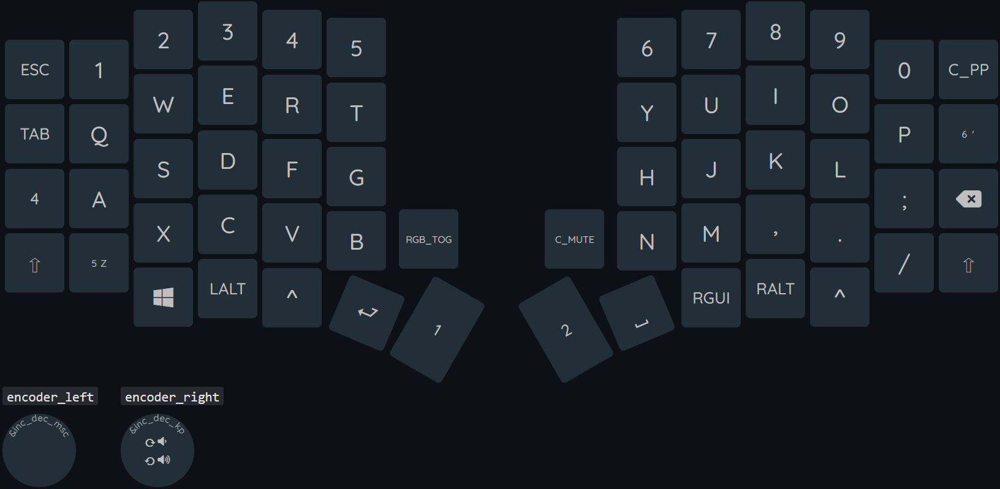
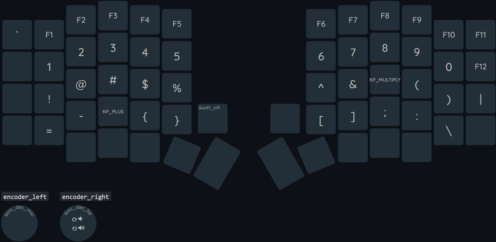
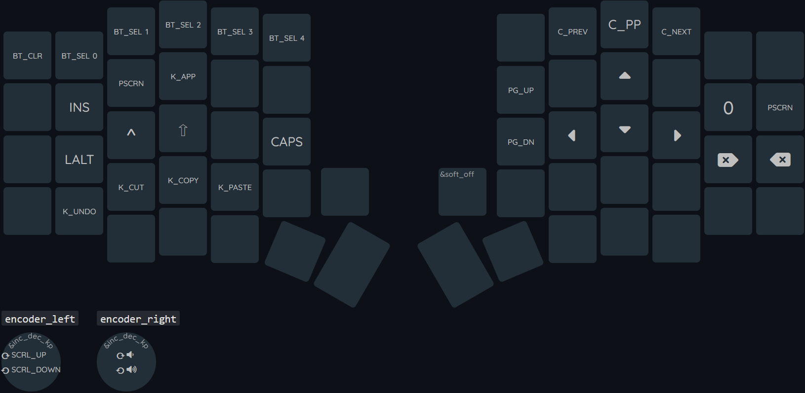
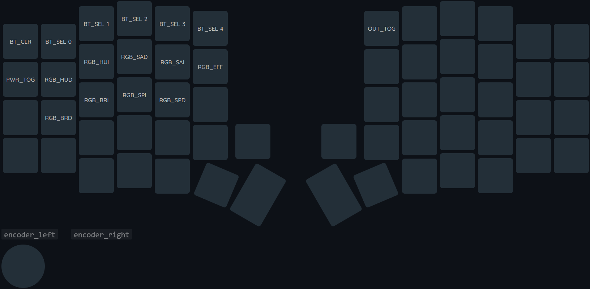
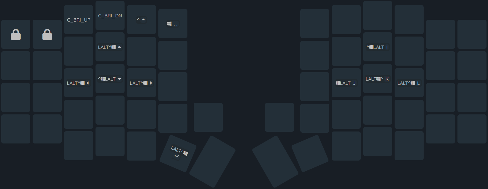
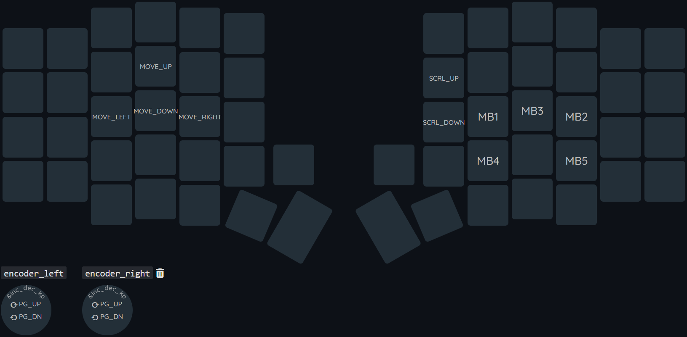
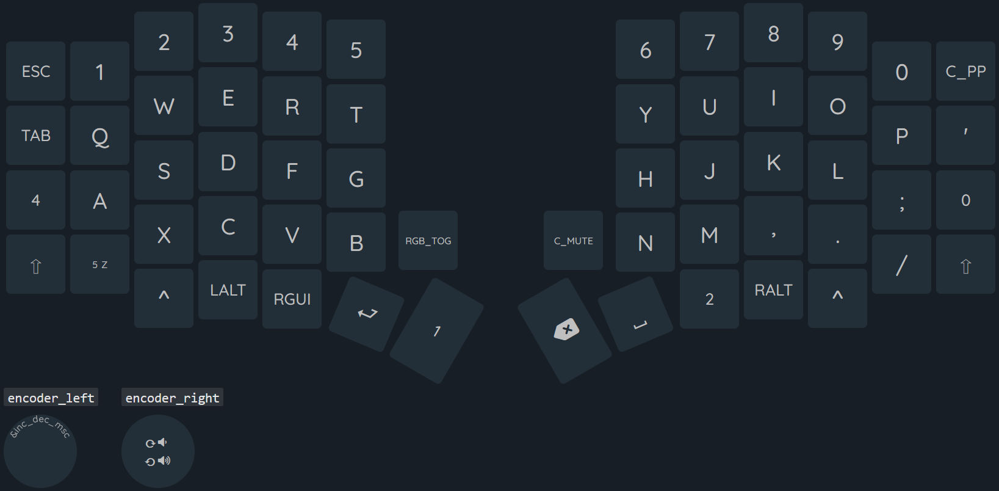

# Jin's zmk-config

This is my personal [ZMK firmware](https://github.com/zmkfirmware/zmk/)
configuration. The layout consists of 60-keys and is mainly used on my sofle V2.1 Board.

## Main Features

### 1. Qwerty

### 3. Num and symbols

### 4. Standard functions and arrow keys

### 5. Board settings adjustment

### 6. [Yabai](https://github.com/koekeishiya/yabai) navigator and mac related shortcuts

### 7. Complete mouse control

### 8. MacOS 

## Minor Features
1. Rotary encoder support (left and right)
2. Oled screen support

## Usage

* Clone your fork of this repository. 
* To change the behaviour of the keyboard, edit the `config/<your-keyboard>.keymap` file.

## License and credits

* The images are created with the help of [@nickcoutsos](https://github.com/nickcoutsos)'s awesome [Keymap Editor](https://github.com/nickcoutsos/keymap-editor)
* This repo is under the MIT license.
